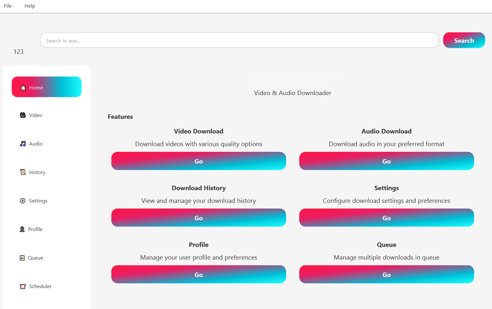
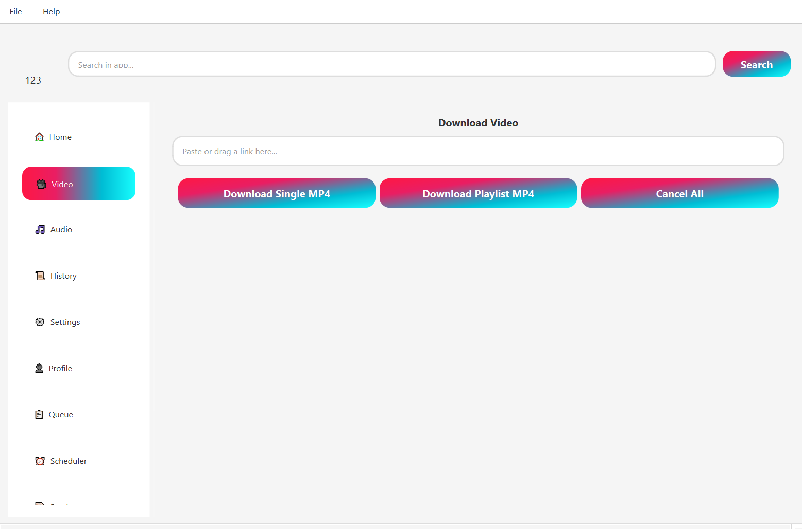
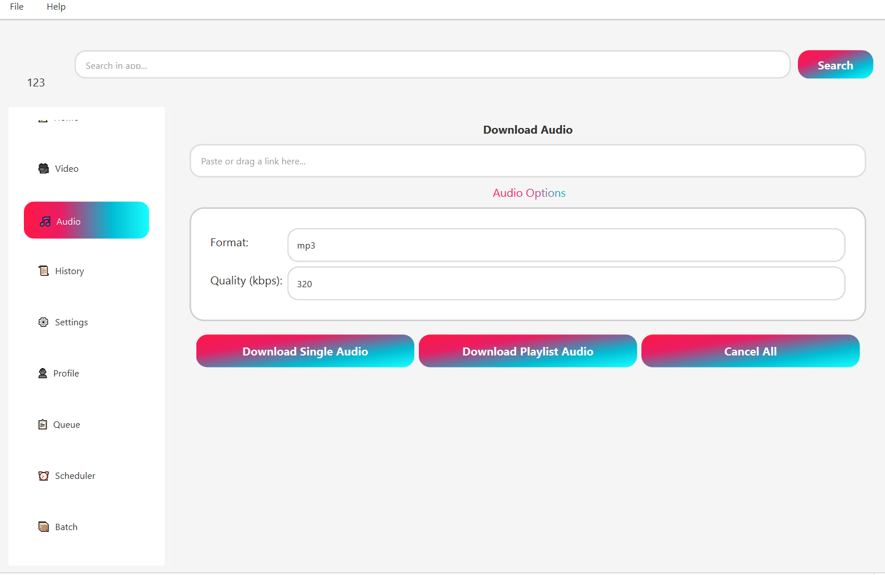
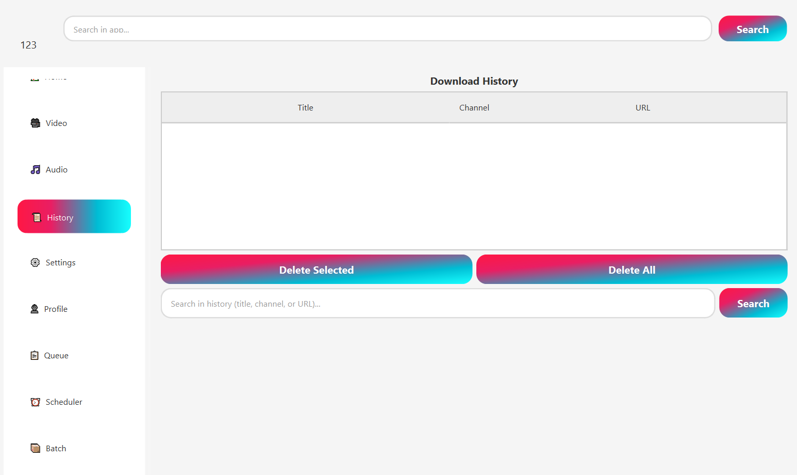

# ❤️ 批量 YouTube 视频下载器 5.0 🎥

批量 **YouTube 视频下载器**，**YouTube MP4 下载器**，**YouTube MP3 下载器**，**在线 YouTube 下载器**，**免费 YouTube 下载器**，**无水印 YouTube 视频下载器**，**无水印 YouTube 视频下载器**，**YouTube 视频下载器 4K/8K**，**最佳高清 YouTube 下载器**。

<div align="center">
  <a href="../../releases/latest">
    
  </a>
</div>

### 现代化 YouTube 下载器，具备高级功能

[](https://www.python.org/)
[](https://pypi.org/project/PySide6/)
[](https://pypi.org/project/requests/)
[](https://ffmpeg.org/)

---

## 📋 目录
- [功能](#-主要功能)
- [安装](/../../releases)
- [使用方法](#-使用方法)
- [截图](showcase/showcase.md)
- [贡献](CONTRIBUTING.md)
- [许可证](LICENSE)

### 📜 法律声明
[](LICENSE)

---

## 🌟 主要功能

### 🛠️ 核心功能
- **下载支持**  
  从任何 YouTube 链接下载 YouTube 视频和音频。支持 **YouTube 播放列表、YouTube 频道、YouTube 短视频和私人/未列出的视频**。

- **智能播放列表组织**  
  自动将播放列表下载整理到以播放列表命名的专用文件夹中。

- **播放列表下载**  
  只需点击几下即可保存整个 **YouTube 播放列表**，并按顺序处理。

- **多种格式**  
  以 **MP4**（视频）和多种音频格式（**MP3**、**M4A**、**WAV**、**AAC**、**FLAC**、**OPUS**、**VORBIS**）下载，具备 **高级质量控制**。

- **高级音频质量控制** 🎵  
  革命性的音频处理系统，具备 **无损提取** 功能：
  - **智能复制模式**：M4A/AAC/OPUS 格式零质量损失
  - **用户控制比特率**：128k、192k、256k、320k 或"最佳"质量
  - **保持原始质量**：避免不必要的重新编码
  - **高保真回退**：320k 比特率 + 48kHz 采样
  - **格式特定优化**：自动为每种格式选择最佳质量

- **高分辨率支持**  
  支持高达 **8K、4K、2K、1080p、720p、360p** 的下载。在设置中选择您喜欢的分辨率。

- **模块化代码库**  
  重构为 `core/`、`ui/` 和 `tests/` 目录，便于维护和贡献。

---

### 🛠️ 高级功能
- **批量处理**  
  将多个 YouTube 视频下载加入队列并同时管理它们。轻松暂停、恢复或取消下载。

- **音频质量革命** 🎵  
  突破性音频处理，**比特率提升 67%** 和 **零损失提取**。

- **配置文件管理**  
  保存您喜欢的设置：用户名、下载路径、视频分辨率和音频格式。

- **配置文件导入/导出**  
  将您的配置文件、设置、历史记录和头像导出为单个 ZIP 文件。在任何设备上导入它们。

- **拖放界面**  
  通过将 YouTube URL 拖入应用程序来添加它们。

- **系统托盘集成**  
  最小化时在系统托盘中运行，通过快速访问菜单恢复或退出。

- **增强下载系统**  
  大文件支持和多个同时下载的稳定性和效率。

- **队列系统优化**  
  暂停/恢复所有功能，通过代理设置进行带宽限制。

- **自动更新器**  
  自动检查更新并安装它们。

---

### 🎨 用户体验
- **深色和浅色模式**  
  在深色和浅色主题之间切换以提高可用性。

- **错误处理**  
  详细的错误日志以调试问题。

- **调度器**  
  安排 YouTube 下载在特定日期和时间开始。

- **下载历史**  
  查看、搜索和管理所有以前的下载。

- **改进的通知系统**  
  **下载完成**、**失败**和**已取消**的通知。

- **增强的用户界面**  
  现代化 UI 动画，带有搜索和筛选选项。

---

### 🔧 技术功能
- **FFmpeg 检测**  
  自动检测 FFmpeg，如果缺失则提示设置。

## 截图

### 主页


### 视频页面


### 音频页面


### 历史记录


---

## ⚙️ 安装

### Windows
- 从 [发布页面](../../releases) 下载最新的 `.exe` 安装程序或 `.zip` 压缩包
- 两个包都包含所有依赖项，包括 FFmpeg
- 运行安装程序或解压 `.zip` 并运行 `YouTube Downloader.exe`

---

## 🔧 使用方法

### 基本使用
```bash
# 启动应用程序
python main.py
```

### 主要功能使用
- 在 **设置** 中配置您的配置文件
- 使用 **MP4** 或 **MP3** 选项卡下载 YouTube 视频或提取音频
- 将多个下载添加到队列
- 提前安排下载

### 提示和技巧
- 拖放快速添加 URL
- 启用系统托盘以在后台运行
- 使用调度器在非高峰时段下载
- **最佳音频质量**：保持原始 + 320k 比特率
- **无损音频**：使用 M4A/FLAC 和复制模式
- 导出您的配置文件以进行迁移

---

## ⚠️ 注意事项

### 要求
```bash
# 需要 FFmpeg
# 某些功能，如音频提取和视频合并，依赖于 FFmpeg。
# 确保它已安装并在您的系统 PATH 中可用。

# 第三方库
# 使用 yt_dlp 进行下载和元数据提取。
```

---

## 🙏 贡献

### 如何贡献
```bash
# 我们欢迎对改进 YouTube 下载器 5.0 的贡献。
# 请通过 GitHub 提交问题或拉取请求。

# 享受使用 YouTube 下载器 5.0！🚀
```

### 开发设置
1. Fork 仓库
2. 创建功能分支
3. 进行更改
4. 提交拉取请求

---

## ⚠️ 法律声明

**YouTube 下载器** 是一个独立的开源项目。  
它独立于 **YouTube** 和 **Google** 运行，执行下载和其他操作时不使用它们的 API。  
此项目不受 YouTube 服务条款的约束。

---

## 🔑 SEO 关键词

**youtube 视频下载器, youtube 下载器高清, youtube 下载器 4k, youtube mp4 下载器, youtube mp3 下载器, youtube 下载器免费, youtube 下载器无水印, 免费下载 youtube 视频, 最佳 youtube 下载器, youtube 视频抓取器, 在线 youtube 下载器, pc 下载 youtube 视频, youtube 下载器安卓, youtube 下载器 iphone, 保存 youtube 视频到相册, youtube 播放列表下载器, youtube 频道下载器, youtube 短视频下载器, youtube 8k 视频下载**

